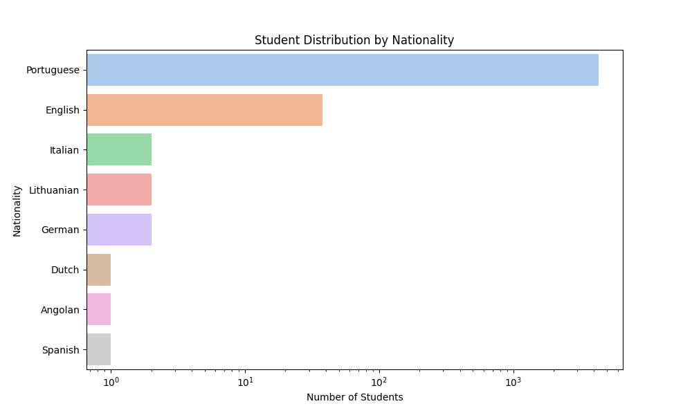
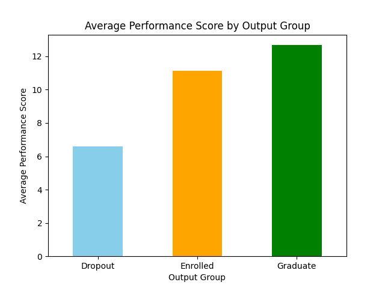
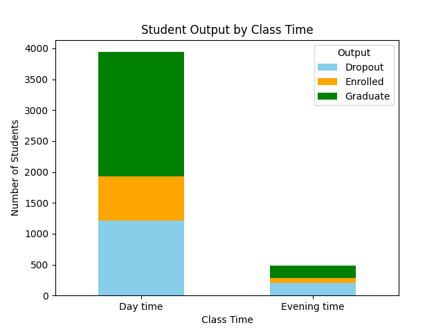
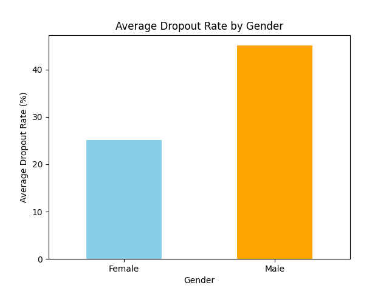

# Student Dropout Analysis
  

---

## Project Overview
This project aims to analyze factors influencing student dropout rates in an educational institution. With the goal to clarify the factors that people usually discuss about the dropout rate such as **gender, student's performance, and behavior** are actually contributing to it.

## Data Source
-**Source**: Dataset is the result of a survey conducted by the institution with 40000+ students from various backgrounds in Europe countries.
-**Key Features Uses**:
- `Gender`: indicating the gender of the student (Male/Female).
- `Student's Performance`: indicating the student's academic performance (e.g., GPA).
- `Class time`: indicating the student's class time (e.g., Morning/Evening).
- `Output`: indicating the student's status (e.g., Dropout, Enrolled, Graduate).

## Key Findings
1. **Gender Disparity**: The results show a significant difference in dropout rates between Male and Female students. Female students tend to have a lower dropout rate compared to Male students.
2. **Performance Impact**: Students with higher academic performance (GPA) are less likely to drop out, indicating that academic success is a protective factor against dropout.
3. **Class Time Influence**: Students attending classes in the evening have a higher dropout rate though the difference is not statistically significant. But this may correlate with other factors like economic status or family responsibilities which need further investigation.

## Recommendations
1. **Targeted Support**: Implement targeted support programs for at-risk students, particularly focusing on Male students and those with lower academic performance.
2. **Academic Interventions**: Develop academic intervention programs to assist students struggling with their coursework, especially in the early stages of their education.
3. **Flexible Class Scheduling**: Consider offering more flexible class scheduling options to accommodate students' varying needs and responsibilities, particularly for those attending evening classes.

## Visualizations
1. **Student Distribution by Nationality**

    

2. **Average Performance Score by Output**
    
    

3. **Student Output by Class Time**
    
    

4. **Average Dropout by Gender**
    
    

## Conclusion
This analysis provides valuable insights into the factors contributing to student dropout rates. By understanding these factors, educational institutions can implement targeted strategies to reduce dropout rates and improve student retention. The findings highlight the importance of addressing gender disparities, supporting at-risk students, and considering the impact of class schedules on student success. For further planning, we will conduct a more detailed analysis on the other factors that may influence dropout rates, such as socioeconomic status, family background, and mental health support then develop a machine learning model to early predict dropout risk based on these factors thereby allowing for proactive interventions.